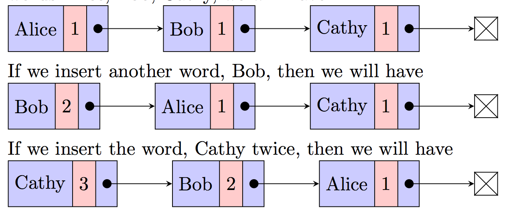

# Project 2: Word Frequency

# Overview
Use a linked list to count the words from a given text file or URL.
The link list is maintained in descending order of frequency.
The frequency class contains a private Node class that has been implemented. 
Nodes are comparable. 
Each node can hold a key (the word), a count (the frequency of the word), and a reference to the next Node in the linked list.

# Objectives
This project practices linked list insert, remove, and test development.

# Word Insertion
The public insert method of the frequency class will be used to insert a word into the linked list. 
When a new word is inserted, it adds the word into the list. 
If the word exists in the list, we simply increment the value of "count" for the word. 
We want to keep the words in the linked list by their frequency order (in descending order of their count). 
Therefore, when the frequency of a word has changed, we have to move the word to the correct position in the linked list. 
If two words have the same frequency, they are sorted alphabetically. For example, if we insert three words Alice, Bob and Cathy, we will have:

When multiple words have the same frequency, they should be arranged in ascending alphabetical order as shown in the above image.

